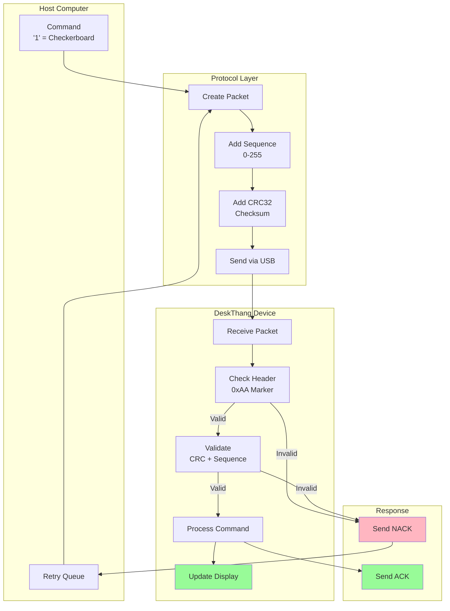
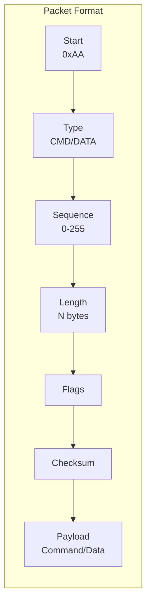
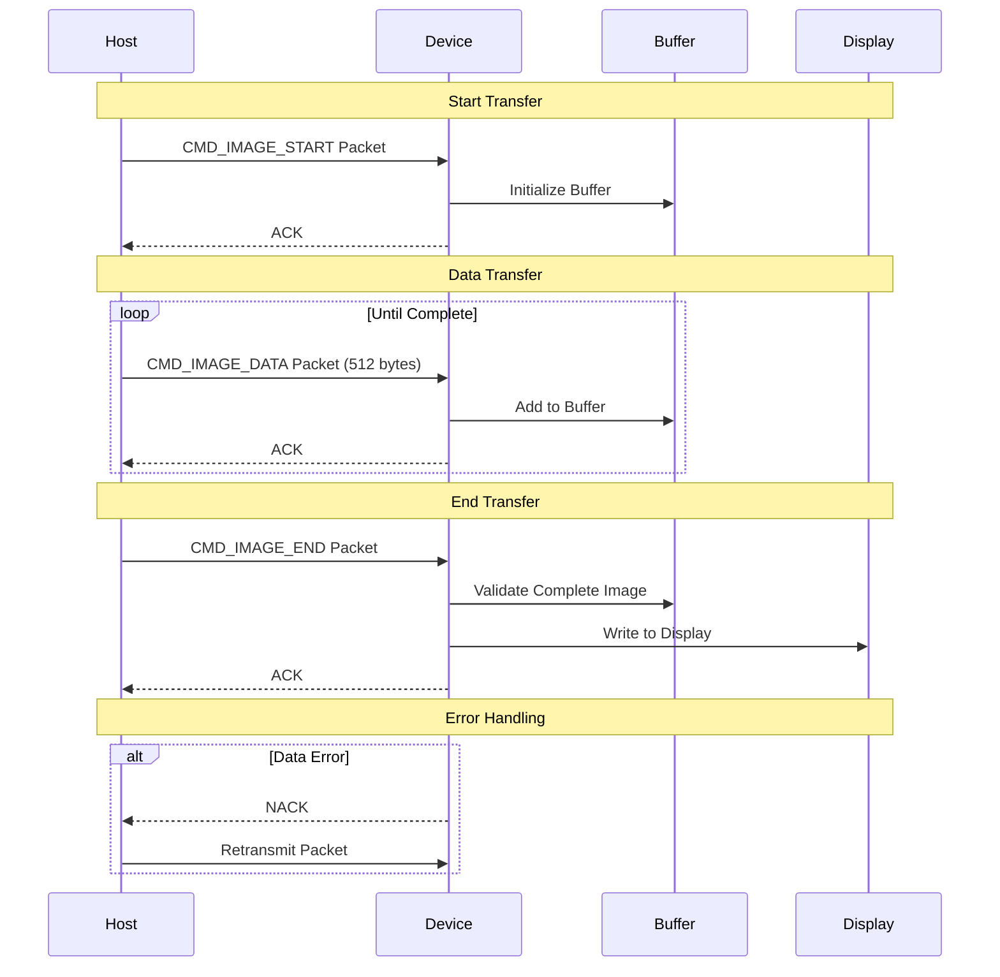
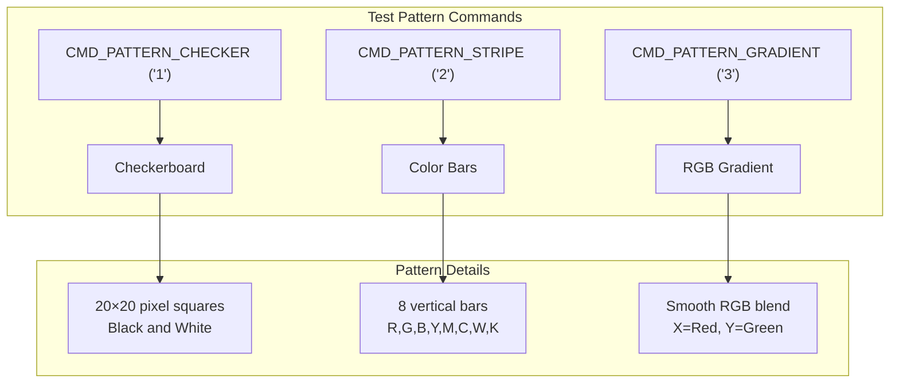

# DeskThang Documentation

## Overview

DeskThang is a USB-connected display device featuring a GC9A01 240×240 round LCD. It provides a reliable interface for displaying images and test patterns through a robust packet-based protocol.

## Hardware

- **Display**: GC9A01 240×240 Round LCD ([display details](display.md))
  - RGB565 color format (16-bit color)
  - SPI interface (Mode 0)
  - Round display shape

## Command Interface

DeskThang accepts the following commands, each wrapped in the packet protocol for reliable delivery:

1. **Test Patterns**
   - `CMD_PATTERN_CHECKER ('1')`: Checkerboard pattern
   - `CMD_PATTERN_STRIPE ('2')`: Color bars pattern
   - `CMD_PATTERN_GRADIENT ('3')`: RGB gradient pattern

2. **Image Transfer**
   - `CMD_IMAGE_START ('I')`: Begin image transfer
   - `CMD_IMAGE_DATA ('D')`: Send image data chunks
   - `CMD_IMAGE_END ('E')`: Complete image transfer

3. **System**
   - `CMD_HELP ('H')`: Display command help

For detailed protocol information, see the [protocol documentation](protocol.md).

## Packet Protocol

All commands are wrapped in packets to ensure reliable delivery. Here's how the protocol works:



The protocol ensures reliable command delivery through:
1. **Packet Creation**
   - Wraps command in header
   - Adds sequence number
   - Calculates CRC32 checksum

2. **Transmission**
   - Sends via USB CDC interface
   - Monitors for acknowledgment
   - Queues for retry if needed

3. **Reception**
   - Validates packet marker
   - Verifies sequence number
   - Checks CRC32 integrity

4. **Processing**
   - Executes valid commands
   - Updates display if needed
   - Sends acknowledgment

5. **Error Handling**
   - Detects corrupted packets
   - Requests retransmission
   - Maintains sequence order

### Why Packets?

The packet protocol provides:
1. **Reliability**: Sequence numbers detect lost or duplicate commands
2. **Integrity**: Checksums ensure data isn't corrupted
3. **Recovery**: Automatic retransmission of failed commands
4. **Validation**: Command parameters are verified before execution

For details on state management, see the [state machine documentation](state_machine.md).

## Example Usage

```bash
# Send a command to display checkerboard pattern
send_packet CMD_PATTERN_CHECKER > /dev/ttyACM0

# Transfer an image
send_packet CMD_IMAGE_START > /dev/ttyACM0
send_image_packets image.raw > /dev/ttyACM0
send_packet CMD_IMAGE_END > /dev/ttyACM0
```

Each command is:
1. Wrapped in a packet header
2. Assigned a sequence number
3. Protected with a checksum
4. Acknowledged by the device
5. Retransmitted if errors occur

## Packet Structure



The packet structure ensures:
- **Synchronization**: Start marker identifies packet boundaries
- **Ordering**: Sequence numbers maintain command order
- **Size Control**: Length field prevents buffer overflows
- **Error Detection**: Checksum validates data integrity

For complete protocol details, see the [protocol documentation](protocol.md).

## State Machine

The device uses a state machine to manage its operation and ensure safe command processing:

```mermaid
stateDiagram-v2
    [*] --> HARDWARE_INIT
    
    subgraph "Initialization"
        HARDWARE_INIT --> DISPLAY_INIT: Hardware Ready
        DISPLAY_INIT --> IDLE: Display Ready
    end
    
    subgraph "Command Processing"
        IDLE --> COMMAND_PROCESSING: Packet Received
        COMMAND_PROCESSING --> DATA_TRANSFER: Image Start
        DATA_TRANSFER --> COMMAND_PROCESSING: Transfer Complete
        COMMAND_PROCESSING --> IDLE: Command Complete
    end
    
    subgraph "Error Handling"
        HARDWARE_INIT --> ERROR: Init Failed
        DISPLAY_INIT --> ERROR: Init Failed
        COMMAND_PROCESSING --> ERROR: Command Failed
        DATA_TRANSFER --> ERROR: Transfer Failed
        ERROR --> IDLE: Recovery Complete
    end
```

### State Flow
1. **Initialization**
   - Device starts in HARDWARE_INIT
   - Configures SPI, GPIO, clocks
   - Initializes display hardware
   - Transitions to IDLE when ready

2. **Command Processing**
   - IDLE state waits for packets
   - Validates each packet
   - Processes commands in order
   - Handles data transfers

3. **Error Recovery**
   - Detects failures at each stage
   - Attempts automatic recovery
   - Returns to IDLE when fixed
   - Logs error information

For complete state machine details, see the [state machine documentation](state_machine.md).

## Image Transfer

Transferring images requires multiple packets due to the display's size (240×240 RGB565 = 115,200 bytes). Here's how it works:



### Transfer Process
1. **Start Transfer**
   - Host sends CMD_IMAGE_START
   - Device allocates buffer
   - Size: 240×240×2 bytes (RGB565)

2. **Data Transfer**
   - Data sent in 512-byte chunks
   - Each chunk wrapped in packet
   - Sequence numbers ensure order

3. **End Transfer**
   - Host sends CMD_IMAGE_END
   - Device validates complete image
   - Writes to display if valid

4. **Error Recovery**
   - Checksums verify each chunk
   - Failed chunks retransmitted
   - Buffer cleaned up on error

For details on the transfer protocol, see the [protocol documentation](protocol.md).

## Test Patterns

The device includes built-in test patterns to verify display operation:



### Pattern Descriptions

1. **Checkerboard Pattern**
   - 20×20 pixel squares
   - Alternating black and white
   - Tests contrast and alignment
   - Verifies pixel boundaries

2. **Color Bars Pattern**
   - 8 vertical color bars
   - Basic colors: Red, Green, Blue
   - Mixed colors: Yellow, Magenta, Cyan
   - Endpoints: White, Black
   - Tests color reproduction

3. **RGB Gradient Pattern**
   - Smooth color transitions
   - Red varies with X position
   - Green varies with Y position
   - Blue varies diagonally
   - Tests color interpolation

Each pattern is useful for:
- Display initialization testing
- Color calibration verification
- Visual quality assessment
- Hardware validation

For details on display capabilities, see the [display documentation](display.md).
