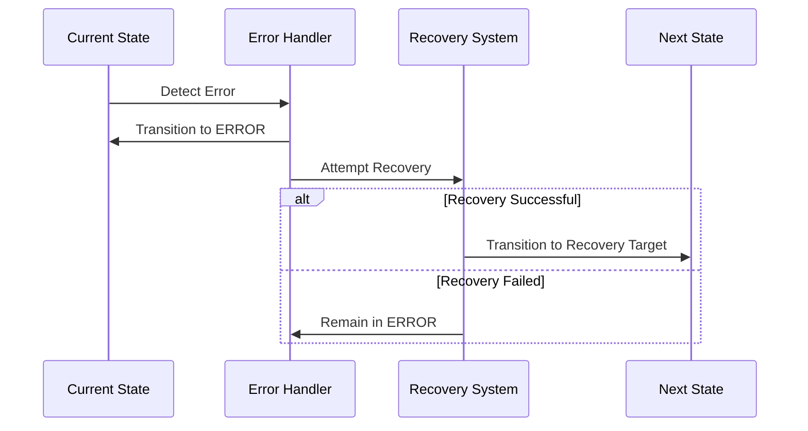

# Protocol Architecture Reference

> Note: All protocol constants referenced in this document are defined in the [Protocol Constants Reference](protocol_constants.md). Always refer to that document for the authoritative values.

## Core Concepts

The protocol implements a robust state machine for managing display communication between a host and device. It handles synchronization, commands, data transfer, and error recovery with clearly defined states and transitions.

## State Machine Architecture


## Protocol Layers

### 1. Hardware Interface Layer

Provides hardware abstraction and timing control.

```c
typedef struct {
    // Core configuration
    uint8_t spi_port;      // SPI port number
    uint32_t spi_baud;     // Baud rate (Hz)
    
    // Pin assignments
    struct {
        uint8_t mosi;      // SPI MOSI pin
        uint8_t sck;       // SPI clock pin
        uint8_t cs;        // Chip select pin
        uint8_t dc;        // Data/command pin
        uint8_t rst;       // Reset pin
    } pins;
    
    // Timing parameters
    struct {
        uint32_t reset_pulse_us;    // Reset pulse width
        uint32_t init_delay_ms;     // Post-init delay
        uint32_t cmd_delay_us;      // Command delay
    } timing;
    
    // Status flags
    bool initialized;              // Hardware init complete
    bool display_ready;           // Display init complete
} HardwareConfig;
```

### 2. Serial Communication Layer

Manages USB CDC communication between host and device.

```c
// Core Functions
bool serial_init(uint32_t baud_rate);              // Initialize USB CDC
bool serial_read_exact(uint8_t *buffer,            // Read exact bytes
                      uint16_t size, 
                      uint32_t timeout_ms);
int16_t serial_read(uint8_t *buffer,              // Read available bytes
                   uint16_t size, 
                   uint32_t timeout_ms);
bool serial_write_exact(const uint8_t *buffer,     // Write exact bytes
                       uint16_t size);
int16_t serial_write(const uint8_t *buffer,       // Write available bytes
                    uint16_t size);

// Buffer Management
void serial_flush(void);                          // Flush TX buffer
bool serial_available(void);                      // Check RX buffer
void serial_clear(void);                         // Clear RX buffer

// Key Features
- Protocol-aware buffering (MAX_PACKET_SIZE, CHUNK_SIZE)
- Timeout-based operations with error reporting
- Automatic flush on chunk boundaries
- Integration with error logging system
- Clean connection management
```


### 3. Protocol Layer

Manages packet handling and protocol state.

```c
typedef struct {
    // Protocol version
    uint8_t version;          // Must be 1
    uint8_t sequence;         // Current sequence number
    
    // Timing configuration
    struct {
        uint32_t base_timeout_ms;      // Base timeout (see protocol_constants.md)
        uint32_t min_retry_delay_ms;   // Min retry delay (see protocol_constants.md)
        uint32_t max_retry_delay_ms;   // Max retry delay (see protocol_constants.md)
        uint8_t max_retries;           // Max retry attempts (see protocol_constants.md)
    } timing;
    
    // Buffer configuration
    struct {
        uint16_t max_packet_size;     // Max packet size (see protocol_constants.md)
        uint16_t chunk_size;          // Transfer chunk size (see protocol_constants.md)
        uint8_t header_size;          // Header size in bytes (see protocol_constants.md)
    } limits;
    
    // State tracking
    uint32_t last_checksum;          // Last valid checksum
    uint32_t packets_processed;       // Packet counter
    uint32_t errors_seen;            // Error counter
} ProtocolConfig;
```

### 4. State Management Layer

Controls state transitions and validation.

```c
typedef struct {
    // Current state
    SystemState current;       // Active state
    SystemState previous;      // Previous state
    
    // Timing
    uint32_t entry_time;      // State entry timestamp
    uint32_t duration;        // Time in current state
    
    // Error handling
    uint8_t retry_count;      // Current retry count
    ErrorContext last_error;  // Last error details
    
    // Validation
    bool transition_valid;    // Last transition valid
    bool in_error_state;     // Error state flag
} StateContext;
```

### 5. Error Management Layer

Handles error detection, logging, and recovery.

The error system is tightly integrated with the state machine:
- All states can transition to ERROR state
- ERROR state has defined recovery paths
- Error context determines recovery strategy
- Recovery success determines next state



```c
typedef struct {
    // Error details
    ErrorType type;              // Error classification
    SystemState source_state;    // State where error occurred
    uint32_t timestamp;         // Error timestamp
    
    // Context data
    uint32_t error_code;        // Specific error code
    char message[64];           // Error description
    
    // Recovery
    uint8_t retry_count;        // Recovery attempts
    uint32_t backoff_ms;        // Current backoff delay
    bool recoverable;           // Can be recovered from
} ErrorContext;
```

### Error Handling System

The error system provides:
1. Error Tracking
   - Category and severity classification
   - Error codes and messages
   - Recoverable status
   - System state context

2. Recovery Management
   - Multiple recovery strategies (NONE, RETRY, RESET_STATE, REINIT, REBOOT)
   - Strategy selection based on error type
   - Automatic retry with backoff
   - Recovery success tracking

3. Logging Integration
   - Structured error logging with context
   - Recovery attempt logging
   - Debug packet support
   - USB CDC transmission

## Implementation Requirements

### 1. State Management

- States must be explicitly defined
- All transitions must be validated
- State history must be maintained
- Timing constraints must be enforced
- Error states must be handled

### 2. Error Handling

- Implement exponential backoff
- Log all errors with context
- Support multiple recovery paths
- Track current error state
- Log errors as they occur

### 3. Buffer Management

- Pre-allocate fixed buffers
- Implement boundary checking
- Support partial transfers
- Validate buffer states
- Handle overflow conditions

### 4. Validation Requirements

- Validate all state transitions
- Check packet integrity (CRC32)
- Verify sequence numbers
- Enforce timing constraints
- Validate configuration

## Protocol Timing

### 1. Core Timeouts

See [Protocol Constants Reference](protocol_constants.md#timing-constants) for the authoritative values:
- Base timeout (BASE_TIMEOUT_MS)
- Minimum retry delay (MIN_RETRY_DELAY_MS)
- Maximum retry delay (MAX_RETRY_DELAY_MS)
- Maximum retries (MAX_RETRIES)

### 2. Backoff Algorithm

```c
uint32_t calculate_backoff(uint8_t retry_count) {
    uint32_t delay = MIN_RETRY_DELAY_MS;
    
    // Exponential backoff with jitter
    for (uint8_t i = 0; i < retry_count && delay < MAX_RETRY_DELAY_MS; i++) {
        delay *= 2;
        delay += (rand() % 50);  // Add jitter
    }
    
    return min(delay, MAX_RETRY_DELAY_MS);
}
```

### 3. Retry Strategy

```c
bool should_retry(ErrorContext *ctx) {
    // Check retry count
    if (ctx->retry_count >= MAX_RETRIES) {
        return false;
    }
    
    // Calculate backoff
    uint32_t delay = calculate_backoff(ctx->retry_count);
    ctx->backoff_ms = delay;
    
    // Update context
    ctx->retry_count++;
    
    return true;
}
```

## Testing Strategy

### 1. State Validation

- Test all valid transitions
- Verify invalid transitions are rejected
- Test error recovery paths
- Validate state history

### 2. Error Recovery

- Test timeout handling
- Verify retry logic
- Test backoff delays
- Validate error logging

### 3. Performance Testing

- Measure round-trip times
- Track retry frequencies
- Monitor buffer usage
- Profile error rates

### 4. Conformance Testing

- Validate packet formats
- Test sequence handling
- Verify checksum calculation
- Test command processing
