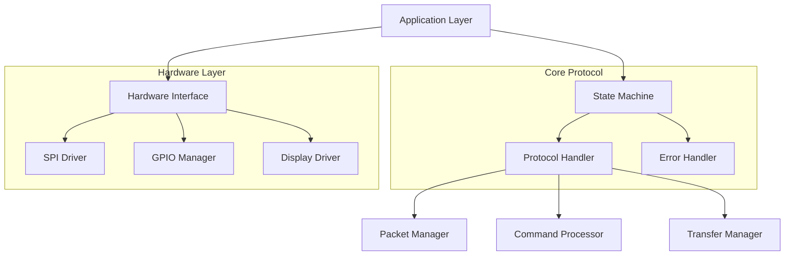

# Protocol Implementation Modules

## Architecture Overview



## Module Interfaces

### 1. Hardware Interface Layer
```c
typedef struct {
    // Core operations
    HardwareStatus (*init)(const HardwareConfig *config);
    void (*deinit)(void);
    void (*reset)(void);
    
    // SPI interface
    bool (*spi_write)(const uint8_t *data, size_t len);
    bool (*spi_read)(uint8_t *data, size_t len);
    bool (*spi_transfer)(const uint8_t *tx, uint8_t *rx, size_t len);
    
    // GPIO control
    void (*gpio_set)(uint8_t pin, bool state);
    bool (*gpio_get)(uint8_t pin);
    void (*gpio_mode)(uint8_t pin, uint8_t mode);
    
    // Display control
    bool (*display_init)(void);
    bool (*display_write)(const uint8_t *data, size_t len);
    void (*display_reset)(void);
    bool (*display_set_mode)(uint8_t mode);
    
    // Timing control
    void (*delay_us)(uint32_t us);
    void (*delay_ms)(uint32_t ms);
    uint32_t (*get_time_us)(void);
} HardwareInterface;
```

### 2. State Machine Interface
```c
typedef struct {
    // State management
    SystemState (*get_state)(void);
    bool (*transition_to)(SystemState new_state, StateCondition condition);
    bool (*can_transition_to)(SystemState new_state);
    
    // Context management
    StateContext (*get_context)(void);
    void (*update_context)(const StateContext *ctx);
    
    // Event handling
    void (*handle_event)(EventType event, const void *data);
    void (*process_timeout)(void);
    
    // Error handling
    void (*handle_error)(const ErrorContext *error);
    bool (*can_recover)(void);
    
    // History
    SystemState (*get_previous_state)(void);
    uint32_t (*get_state_duration)(void);
    bool (*was_in_state)(SystemState state);
} StateMachine;
```

### 3. Protocol Handler Interface
```c
typedef struct {
    // Core protocol
    bool (*init)(const ProtocolConfig *config);
    void (*deinit)(void);
    void (*reset)(void);
    
    // Packet handling
    bool (*process_packet)(const Packet *packet);
    bool (*send_packet)(PacketType type, const uint8_t *data, size_t len);
    bool (*validate_packet)(const Packet *packet);
    
    // Command processing
    bool (*handle_command)(const Command *cmd);
    bool (*send_response)(PacketType type, uint8_t sequence);
    bool (*validate_command)(const Command *cmd);
    
    // Transfer management
    bool (*start_transfer)(uint32_t total_size);
    bool (*process_chunk)(const uint8_t *data, size_t len);
    bool (*end_transfer)(void);
    TransferStatus (*get_transfer_status)(void);
    
    // Synchronization
    bool (*send_sync)(void);
    bool (*handle_sync)(const Packet *packet);
    bool (*is_synchronized)(void);
} ProtocolHandler;
```

### 4. Error Handler Interface
```c
typedef struct {
    // Error management
    void (*report_error)(ErrorType type, const char *msg);
    bool (*handle_error)(const ErrorContext *ctx);
    void (*clear_error)(void);
    
    // Recovery
    bool (*can_recover)(ErrorType type);
    bool (*attempt_recovery)(void);
    RecoveryStrategy (*get_recovery_strategy)(const ErrorContext *ctx);
    
    // History
    void (*log_error)(const ErrorContext *ctx);
    ErrorContext (*get_last_error)(void);
    uint32_t (*get_error_count)(void);
    
    // Retry management
    uint32_t (*get_retry_delay)(void);
    bool (*should_retry)(void);
    void (*reset_retry_count)(void);
} ErrorHandler;
```

## Module Implementation Guidelines

### 1. Hardware Layer Implementation
```c
// Example SPI implementation
static const HardwareInterface hw_interface = {
    .init = hardware_init_impl,
    .spi_write = spi_write_impl,
    .gpio_set = gpio_set_impl,
    .display_init = display_init_impl,
    // ... other implementations ...
};

static bool spi_write_impl(const uint8_t *data, size_t len) {
    // Configure SPI
    spi_set_format(spi_port, 8, SPI_CPOL_0, SPI_CPHA_0, SPI_MSB_FIRST);
    
    // Start transfer
    gpio_put(PIN_CS, 0);
    
    // Write data
    size_t transferred = spi_write_blocking(spi_port, data, len);
    
    // End transfer
    gpio_put(PIN_CS, 1);
    
    return transferred == len;
}
```

### 2. Protocol Layer Implementation
```c
// Example packet handling
static const ProtocolHandler protocol_handler = {
    .init = protocol_init_impl,
    .process_packet = process_packet_impl,
    .validate_packet = validate_packet_impl,
    // ... other implementations ...
};

static bool process_packet_impl(const Packet *packet) {
    // Validate packet
    if (!validate_packet_impl(packet)) {
        error_handler->report_error(ERROR_INVALID_PACKET, "Packet validation failed");
        return false;
    }
    
    // Process by type
    switch (packet->type) {
        case PACKET_TYPE_SYNC:
            return handle_sync_packet(packet);
            
        case PACKET_TYPE_CMD:
            return handle_command_packet(packet);
            
        case PACKET_TYPE_DATA:
            return handle_data_packet(packet);
            
        default:
            error_handler->report_error(ERROR_INVALID_TYPE, "Unknown packet type");
            return false;
    }
}
```

### 3. Error Handler Implementation

#### Error Types

The error handling system defines several categories of errors and severity levels to enable appropriate handling and recovery strategies.

##### Error Severity Levels
```c
typedef enum {
    ERROR_SEVERITY_INFO,     // Informational, no impact
    ERROR_SEVERITY_WARNING,  // Warning, operation can continue
    ERROR_SEVERITY_ERROR,    // Error, operation failed but recoverable
    ERROR_SEVERITY_FATAL     // Fatal error, system needs reset
} ErrorSeverity;
```

##### Error Categories
```c
typedef enum {
    ERROR_CAT_NONE,
    ERROR_CAT_HARDWARE,    // Hardware-related errors (SPI, GPIO, display)
    ERROR_CAT_PROTOCOL,    // Protocol-related errors (packets, sync)
    ERROR_CAT_STATE,       // State machine errors (invalid transitions)
    ERROR_CAT_COMMAND,     // Command processing errors (invalid commands)
    ERROR_CAT_TRANSFER,    // Data transfer errors (chunks, validation)
    ERROR_CAT_SYSTEM      // System-level errors (initialization, resources)
} ErrorCategory;
```

##### Error Details Structure
```c
typedef struct {
    ErrorCategory category;     // Error category
    ErrorSeverity severity;     // Error severity
    uint32_t code;             // Error code
    uint32_t timestamp;        // When error occurred
    SystemState state;         // State when error occurred
    char message[128];         // Error message
    char context[256];         // Additional context
    bool recoverable;          // Can be recovered from
} ErrorDetails;
```

##### Recovery Configuration and Persistence

```c
// Recovery configuration
typedef struct {
    uint32_t max_retries;          // Maximum retry attempts
    uint32_t base_delay_ms;        // Base delay between retries
    uint32_t max_delay_ms;         // Maximum delay between retries
    bool allow_reboot;             // Whether reboot recovery is allowed
} RecoveryConfig;

// Recovery attempt result
typedef struct {
    bool success;            // Recovery succeeded
    uint32_t duration_ms;    // How long recovery took
    uint32_t attempts;       // Number of attempts made
    char message[128];       // Result message
} RecoveryResult;

// Recovery statistics
typedef struct {
    uint32_t total_attempts;     // Total recovery attempts
    uint32_t successful;         // Successful recoveries
    uint32_t failed;            // Failed recoveries
    uint32_t aborted;           // Aborted recoveries
    uint32_t total_retry_time;  // Total time spent in recovery
} RecoveryStats;

// Recovery handler type
typedef bool (*RecoveryHandler)(const ErrorDetails *error);
```

##### Recovery Persistence Functions

```c
// Configuration management
void recovery_configure(const RecoveryConfig *config);
RecoveryConfig *recovery_get_config(void);

// Recovery handlers
bool recovery_register_handler(RecoveryStrategy strategy, RecoveryHandler handler);
RecoveryHandler recovery_get_handler(RecoveryStrategy strategy);

// Statistics tracking
RecoveryStats *recovery_get_stats(void);
void recovery_reset_stats(void);

// Recovery execution
RecoveryResult recovery_attempt(const ErrorDetails *error);
bool recovery_abort(void);
bool recovery_is_in_progress(void);

// Retry management
bool recovery_should_retry(uint32_t attempt_count);
uint32_t recovery_get_retry_delay(uint32_t attempt_count);
void recovery_wait_before_retry(uint32_t delay_ms);
```

##### Error History and Statistics
```c
// Error history entry
typedef struct {
    ErrorDetails error;        // Error details
    uint32_t frequency;        // How often this error occurs
    uint32_t last_seen;       // Last occurrence
    uint32_t first_seen;      // First occurrence
} ErrorHistoryEntry;

// Error statistics
typedef struct {
    uint32_t total_errors;    // Total errors seen
    uint32_t recoverable;     // Recoverable errors
    uint32_t unrecoverable;   // Unrecoverable errors
    uint32_t retries;         // Total retry attempts
    uint32_t recoveries;      // Successful recoveries
} ErrorStats;
```

#### Implementation Example
```c
// Example error handling
static const ErrorHandler error_handler = {
    .report_error = report_error_impl,
    .handle_error = handle_error_impl,
    .attempt_recovery = attempt_recovery_impl,
    // ... other implementations ...
};

static bool handle_error_impl(const ErrorContext *ctx) {
    // Log error
    log_error_context(ctx);
    
    // Check if recoverable
    if (!can_recover(ctx->type)) {
        return false;
    }
    
    // Get recovery strategy
    RecoveryStrategy strategy = get_recovery_strategy(ctx);
    
    // Execute recovery
    return execute_recovery_strategy(strategy, ctx);
}
```

## Module Organization

```
src/
├── hardware/           // Hardware abstraction layer
│   ├── hardware.c     // Core hardware interface
│   ├── spi.c         // SPI implementation
│   ├── gpio.c        // GPIO implementation
│   └── display.c     // Display driver
│
├── protocol/          // Protocol implementation
│   ├── protocol.c    // Core protocol handler
│   ├── packet.c      // Packet management
│   ├── command.c     // Command processing
│   └── transfer.c    // Data transfer
│
├── state/            // State management
│   ├── state.c       // State machine core
│   ├── context.c     // State context
│   └── transition.c  // State transitions
│
└── error/            // Error handling
    ├── error.c       // Error management
    ├── recovery.c    // Recovery strategies
    └── logging.c     // Error logging
```

## Implementation Requirements

### 1. Module Independence
- Each module must be self-contained
- Clear interfaces between modules
- Minimal cross-module dependencies
- Use opaque pointers for implementation details

### 2. Resource Management
- Clear ownership of resources
- Proper initialization/cleanup
- Resource validation
- Error checking on all operations

### 3. Error Handling
- Each module handles its own errors
- Clear error propagation paths
- Comprehensive error reporting
- Recovery mechanisms

### 4. Testing
- Unit tests per module
- Integration tests
- Error injection tests
- Performance benchmarks

### 5. Documentation
- Interface documentation
- Implementation notes
- Error codes and meanings
- Usage examples

## Build Integration

```cmake
# Module organization in CMake
add_library(hardware
    src/hardware/hardware.c
    src/hardware/spi.c
    src/hardware/gpio.c
    src/hardware/display.c
)

add_library(protocol
    src/protocol/protocol.c
    src/protocol/packet.c
    src/protocol/command.c
    src/protocol/transfer.c
)

add_library(state_machine
    src/state/state.c
    src/state/context.c
    src/state/transition.c
)

add_library(error_handler
    src/error/error.c
    src/error/recovery.c
    src/error/logging.c
)

add_executable(display_controller
    src/main.c
)

target_link_libraries(display_controller
    hardware
    protocol
    state_machine
    error_handler
)
