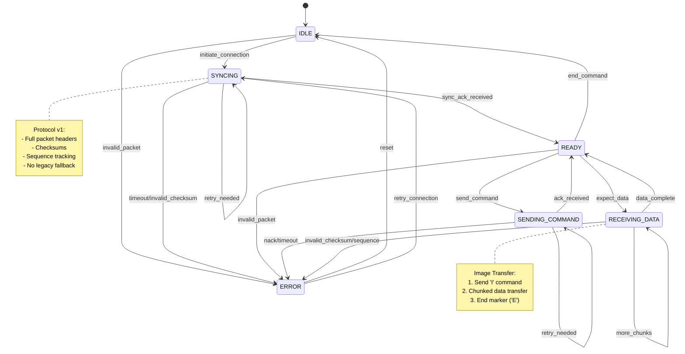

# Protocol State Machine Documentation

## Overview

This document defines the reference state machine for the display protocol (v1). It describes a single-version, packet-based protocol, which both the host (Zig) and device (C) implementations must follow.

## Conformance Requirements

### Host Implementation

The host implementation MUST:

- Send and respond to the SYNC handshake
- Implement proper error recovery
- Manage timeouts and retries
- Support all defined commands

### Device Implementation

The device implementation MUST:

- Initialize hardware properly
- Handle the SYNC handshake and send SYNC_ACK
- Manage display state transitions
- Implement proper error handling

### Version Compatibility

- Protocol version 1 is the sole version
- No fallback or legacy support required

## State Machine Diagram



## Hardware States

### 1. HARDWARE_INIT

Initial hardware setup state.

#### Entry Actions
- Initialize SPI interface
- Configure GPIO pins
- Reset display controller

#### Transitions
- → DISPLAY_INIT (on successful hardware init)
- → ERROR (on hardware failure)

### 2. DISPLAY_INIT

Display controller initialization state.

#### Entry Actions
- Send display initialization sequence
- Configure display parameters
- Set default display mode

#### Transitions
- → IDLE (on successful init)
- → ERROR (on initialization failure)

## Protocol States

### 1. IDLE

Default protocol state before communication starts.

#### Transitions
- → SYNCING (when initiating communication)
- → ERROR (on invalid packet received)

### 2. SYNCING

Attempting to establish synchronization.

#### Entry Action
- Send SYNC packet

#### Transitions
- → READY (on receiving SYNC_ACK)
- → ERROR (on timeout or invalid checksum)
- → SYNCING (on retry needed)

### 3. READY

Connection established; ready to send/receive commands or data.

#### Transitions
- → SENDING_COMMAND (when sending a command)
- → RECEIVING_DATA (when expecting data)
- → ERROR (on invalid packet)
- → IDLE (on END command)

### 4. SENDING_COMMAND

Transmitting a command to the device.

#### Entry Action
- Send CMD packet

#### Transitions
- → READY (on ACK received)
- → ERROR (on NACK or timeout)
- → SENDING_COMMAND (on retry needed)

### 5. RECEIVING_DATA

Receiving data chunks from the device (or the host if on device side).

#### Transitions
- → READY (on complete data received)
- → ERROR (on invalid checksum or sequence)
- → RECEIVING_DATA (when expecting more chunks)

### 6. ERROR

Error state with recovery options.

#### Common Errors
- InvalidSync: Synchronization failure
- InvalidChecksum: Data corruption detected
- InvalidSequence: Packet sequence mismatch
- Timeout: Operation timed out
- NackReceived: Command rejected
- InvalidPacketType: Unknown packet type

#### Transitions
- → IDLE (on reset)
- → SYNCING (on retry connection)

## Implementation Validation

### State Validation Matrix

| State | Host Requirements | Device Requirements | Validation Criteria |
|-------|------------------|---------------------|-------------------|
| HARDWARE_INIT | N/A | Must initialize SPI and GPIO | - Correct pin config<br>- SPI timing<br>- Reset sequence timing |
| DISPLAY_INIT | N/A | Must configure display correctly | - Init sequence<br>- Display params<br>- Default mode |
| SYNCING | Must implement retry logic | Must respond to SYNC | - Timeout<br>- Retry counts<br>- Version check |
| READY | Track active connection | Maintain ready state | - Command acceptance<br>- State consistency<br>- Error detection |
| SENDING_COMMAND | Handle ACK/NACK & timeouts | Verify commands & return correct ACK/NACK | - Sequence tracking<br>- Retry handling<br>- Timeout management |
| RECEIVING_DATA | Accept chunked data & validate checksums | Provide chunked data | - Checksum validation<br>- Sequence check<br>- Buffer mgmt |
| ERROR | Implement and track error recovery paths | Must support reset/retry | - Error classification<br>- Logging<br>- Automatic resets |

### Implementation Gaps Analysis

#### Host (Zig) Implementation

##### Sync & Error Handling
- Send/receive SYNC, SYNC_ACK
- Implement timeouts and retries
- Handle various error states

##### Command Sending
- Use proper CMD packets
- Validate ACK/NACK

##### Data Transfer
- Chunk data into 256-byte payloads
- Check ACK after each chunk
- Handle retransmissions

#### Device (C) Implementation

##### Sync & Ack
- Respond to SYNC with SYNC_ACK
- Validate checksums, sequence

##### Display Management
- Handle I (image) and pattern commands (1, 2, 3)
- Update display states accordingly

##### Data Handling
- Accept chunked image data
- Send ACK or NACK per chunk
- Reset state machine on errors

### Conformance Testing

#### Protocol Sync Test
- Host sends SYNC
- Device responds SYNC_ACK
- Validate timeouts/retries

#### Command/ACK Test
- Host sends various commands (1, 2, 3, I)
- Verify device acknowledges or rejects properly

#### Image Transfer Test
- Send I command
- Transfer data in chunks
- Verify display updates and final ACK

#### Error Injection Test
- Inject bad checksums or sequences
- Check that device/host retries and recovers

## Protocol Parameters

### Timing
- Base Timeout: 1000ms
- Min Retry Delay: 50ms
- Max Retry Delay: 1000ms
- Max Retries: 8

### Packet Structure
- Maximum Packet Size: 512 bytes
- Header Size: 8 bytes
- Chunk Size: 256 bytes

### Header Format

```c
PacketHeader {
    type: PacketType,      // 1 byte
    sequence: u8,          // 1 byte
    length: u16,           // 2 bytes
    checksum: u32,         // 4 bytes
}
```

### Packet Types
- 0x1B: SYNC
- 0x1C: SYNC_ACK
- 0x1D: CMD
- 0x1E: DATA
- 0x1F: ACK
- 0x20: NACK

### Commands
- 1: Checkerboard pattern
- 2: Stripes pattern
- 3: Gradient pattern
- I: Image transfer (240×240 RGB565)
- H: Help menu
- E: End session

## Image Transfer States

### Image Command
- Send I command
- Wait for ACK
- Full packet with checksum

### Data Transfer
- Split data into 256-byte chunks
- Send each chunk, wait for ACK
- Retry on failure (up to 8 times)
- Use sequence numbers

### End Marker
- Send E command
- Wait for final ACK

## Error Recovery Strategies

### Sync Loss Recovery
- Return to IDLE
- Clear pending data
- Initiate new SYNC
- Use exponential backoff on retries

### Checksum Error Recovery
- Request retransmission (NACK)
- Track failed attempts (up to 8)
- Log checksum values

### Sequence Error Recovery
- Request missing packets (NACK)
- Reset sequence if unrecoverable
- Log discontinuities

### Timeout Recovery
- Use exponential backoff (50ms to 1000ms)
- Abort after 8 retries
- Log timing stats

## Debugging Considerations

### State Tracking
- Log state transitions with timestamps
- Track retry counts per operation

### Error Monitoring
- Log errors with context and timestamps
- Monitor recovery success rates

### Performance Metrics
- Measure round-trip times
- Track retry frequencies and checksum failures

### Data Integrity
- Validate all packet fields
- Monitor packet sizes and CRC32 performance
