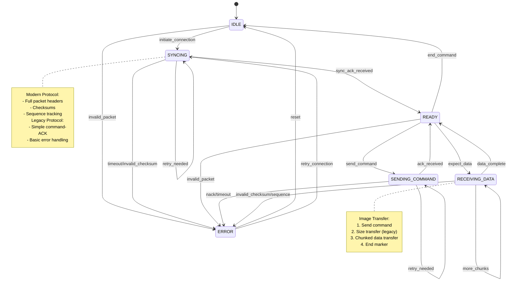

# Protocol State Machine Documentation

## Overview
This document defines the reference state machine for the display protocol (v1). It serves as the standard specification that both host (Zig) and device (C) implementations must conform to. The protocol supports both a modern packet-based mode and a legacy mode for backward compatibility.

## Conformance Requirements

### Host Implementation
The host implementation MUST:
1. Support both modern and legacy protocols
2. Handle version negotiation gracefully
3. Implement proper error recovery
4. Manage timeouts and retries
5. Support all defined commands

### Device Implementation
The device implementation MUST:
1. Initialize hardware properly
2. Support protocol version detection
3. Handle both protocols simultaneously
4. Manage display state transitions
5. Implement proper error handling

### Version Compatibility
- Protocol version 1 is current
- Legacy protocol must be supported
- Version negotiation is mandatory
- Fallback must be graceful

## State Machine Diagram



### Protocol Versions
- **Modern Protocol (v1)**
  - Full packet structure with headers and checksums
  - Robust error handling and recovery
  - Sequence tracking
  - Support for all commands

- **Legacy Protocol**
  - Simple command-ACK structure
  - Basic error detection
  - Limited retry capability
  - Primarily for image transfer compatibility

## Hardware States

### 1. HARDWARE_INIT
Initial hardware setup state.
- Entry Actions:
  - Initialize SPI interface
  - Configure GPIO pins
  - Reset display controller
- Transitions:
  - → DISPLAY_INIT (on successful hardware init)
  - → ERROR (on hardware failure)

### 2. DISPLAY_INIT
Display controller initialization state.
- Entry Actions:
  - Send display initialization sequence
  - Configure display parameters
  - Set default display mode
- Transitions:
  - → IDLE (on successful init)
  - → ERROR (on initialization failure)

## Protocol States

### 1. IDLE
Initial state of the protocol.
- Transitions:
  - → SYNCING (when initiating communication)
  - → ERROR (on invalid packet received)

### 2. VERSION_DETECT
Protocol version detection state.
- Entry Actions:
  - Clear input buffers
  - Wait for initial command
- Transitions:
  - → SYNCING (on modern protocol detection)
  - → LEGACY_MODE (on legacy command detection)
  - → ERROR (on invalid data)

### 3. SYNCING
Attempting to establish synchronization.
- Entry Action: Send SYNC packet
- Transitions:
  - → READY (on receiving SYNC_ACK)
  - → ERROR (on timeout after MAX_RETRIES)
  - → ERROR (on invalid checksum)
  - → SYNCING (on retry needed)

### 3. LEGACY_MODE
Legacy protocol handling state.
- Entry Actions:
  - Disable packet processing
  - Enable single-byte command mode
- Transitions:
  - → COMMAND_PROCESSING (on command byte)
  - → ERROR (on invalid byte)
  - → VERSION_DETECT (on protocol switch attempt)

### 4. READY
Connection established and ready for commands.
- Transitions:
  - → SENDING_COMMAND (when sending command)
  - → RECEIVING_DATA (when expecting data)
  - → ERROR (on invalid packet)
  - → IDLE (on END command)

### 4. COMMAND_PROCESSING
Command validation and execution state.
- Entry Actions:
  - Validate command
  - Prepare display if needed
- Transitions:
  - → SENDING_COMMAND (modern protocol)
  - → DISPLAY_UPDATE (legacy protocol)
  - → ERROR (on invalid command)

### 5. SENDING_COMMAND
Transmitting a command to the device.
- Entry Action: Send CMD packet
- Transitions:
  - → READY (on ACK received)
  - → ERROR (on NACK received)
  - → ERROR (on timeout)
  - → SENDING_COMMAND (on retry needed)

### 5. DISPLAY_UPDATE
Display content update state.
- Entry Actions:
  - Set display frame
  - Configure memory access
  - Prepare for data
- Transitions:
  - → RECEIVING_DATA (for image data)
  - → PATTERN_DRAW (for test patterns)
  - → ERROR (on display error)

### 6. PATTERN_DRAW
Test pattern generation state.
- Entry Actions:
  - Calculate pattern data
  - Configure display access
- Transitions:
  - → READY (on completion)
  - → ERROR (on drawing failure)

### 7. RECEIVING_DATA
Receiving data chunks from device.
- Transitions:
  - → READY (on complete data received)
  - → ERROR (on invalid checksum)
  - → ERROR (on invalid sequence)
  - → RECEIVING_DATA (when expecting more chunks)

### 8. ERROR
Error state with recovery options.
- Error Types:
  - InvalidSync: Synchronization failure
  - InvalidChecksum: Data corruption detected
  - InvalidSequence: Packet sequence mismatch
  - Timeout: Operation timed out
  - NackReceived: Command rejected
  - InvalidPacketType: Unknown packet type received
- Transitions:
  - → IDLE (on reset)
  - → SYNCING (on retry connection)

## Implementation Validation

### State Validation Matrix

| State | Host Requirements | Device Requirements | Validation Criteria |
|-------|------------------|---------------------|-------------------|
| HARDWARE_INIT | N/A | Must initialize SPI and GPIO | - Correct pin configuration<br>- SPI timing verification<br>- Reset sequence timing |
| DISPLAY_INIT | N/A | Must configure display correctly | - Initialization sequence<br>- Display parameters<br>- Default mode setting |
| VERSION_DETECT | Must attempt modern protocol | Must support detection | - Protocol version check<br>- Fallback handling<br>- Buffer clearing |
| SYNCING | Must implement retry logic | Must respond to sync | - Timeout handling<br>- Retry counting<br>- Version verification |
| LEGACY_MODE | Must support fallback | Must handle legacy commands | - Command validation<br>- Simple ACK handling<br>- Error recovery |
| READY | Must track connection state | Must maintain ready state | - Command acceptance<br>- State consistency<br>- Error detection |
| COMMAND_PROCESSING | Must validate commands | Must process all commands | - Command validation<br>- Display preparation<br>- Error handling |
| SENDING_COMMAND | Must handle ACK/NACK | Must verify commands | - Sequence tracking<br>- Retry handling<br>- Timeout management |
| DISPLAY_UPDATE | Must wait for completion | Must update display | - Frame configuration<br>- Memory access<br>- Error detection |
| PATTERN_DRAW | Must wait for completion | Must draw patterns | - Pattern accuracy<br>- Drawing performance<br>- Error handling |
| RECEIVING_DATA | Must chunk data properly | Must handle all chunks | - Sequence tracking<br>- Checksum validation<br>- Buffer management |
| ERROR | Must implement recovery | Must support recovery | - Error classification<br>- Recovery paths<br>- State restoration |

### Implementation Gaps Analysis

#### Host (Zig) Implementation
1. Version Detection
   - [ ] Implement protocol version detection
   - [ ] Add version compatibility check
   - [ ] Support graceful fallback

2. Error Handling
   - [ ] Add exponential backoff
   - [ ] Implement all recovery paths
   - [ ] Add detailed error logging

3. Buffer Management
   - [ ] Add buffer overflow protection
   - [ ] Implement proper chunking
   - [ ] Add sequence validation

#### Device (C) Implementation
1. Protocol Support
   - [ ] Add version negotiation
   - [ ] Implement both protocols
   - [ ] Add protocol switching

2. Display Management
   - [ ] Add display state tracking
   - [ ] Implement all test patterns
   - [ ] Add error recovery

3. Memory Management
   - [ ] Add buffer protection
   - [ ] Implement safe transfers
   - [ ] Add overflow checking

### Conformance Testing

1. Protocol Negotiation Test
   ```
   1. Start connection
   2. Verify version detection
   3. Test fallback scenario
   4. Verify protocol switch
   ```

2. Error Recovery Test
   ```
   1. Inject checksum errors
   2. Force timeouts
   3. Test sequence errors
   4. Verify recovery paths
   ```

3. Display Function Test
   ```
   1. Test all patterns
   2. Verify image transfer
   3. Check error handling
   4. Validate state transitions
   ```

## Protocol Parameters

### Timing
- Base Timeout: 1000ms
- Min Retry Delay: 50ms
- Max Retry Delay: 1000ms
- Max Retries: 8

### Packet Structure
- Maximum Packet Size: 512 bytes
- Header Size: 8 bytes
- Chunk Size: 256 bytes

### Header Format
```
PacketHeader {
    type: PacketType,      // 1 byte
    sequence: u8,          // 1 byte
    length: u16,           // 2 bytes
    checksum: u32,         // 4 bytes
}
```

### Packet Types
- 0x1B: SYNC
- 0x1C: SYNC_ACK
- 0x1D: CMD
- 0x1E: DATA
- 0x1F: ACK
- 0x20: NACK

### Commands
- '1': Checkerboard pattern
- '2': Stripes pattern
- '3': Gradient pattern
- 'I': Image transfer (240x240 RGB565)
- 'H': Help menu
- 'E': End session

### Image Transfer States
1. **Image Command**
   - Send 'I' command
   - Wait for ACK
   - Modern: Full packet with checksum
   - Legacy: Single byte with ACK

2. **Size Transfer** (Legacy only)
   - Send 4-byte size (big endian)
   - Wait for ACK
   - Verify size matches 240x240 RGB565

3. **Data Transfer**
   - Split data into 256-byte chunks
   - For each chunk:
     - Send chunk data
     - Wait for ACK
     - Retry on failure (up to 8 times)
     - Track sequence numbers (modern only)

4. **End Marker**
   - Send 'E' command
   - Wait for final ACK
   - Modern: Full packet with checksum
   - Legacy: Single byte with ACK

## Error Recovery Strategies

1. **Sync Loss Recovery**
   - Reset to IDLE state
   - Clear any pending data in buffers
   - Initiate new sync sequence with version check
   - Implement exponential backoff between retries (50ms base, doubles each retry)
   - Fall back to legacy protocol if version mismatch

2. **Checksum Error Recovery**
   - Request retransmission of last packet
   - Track failed attempts (up to 8 retries)
   - Use exponential backoff between retries
   - Reset connection if persistent
   - Log checksum values for debugging

3. **Sequence Error Recovery**
   - Request missing packets
   - Reset sequence if unrecoverable
   - Log sequence discontinuity

4. **Timeout Recovery**
   - Base timeout: 1000ms
   - Implement exponential backoff (50ms to 1000ms)
   - Reset connection after 8 retries
   - Log timing statistics and retry patterns
   - Consider network conditions for retry timing

## Debugging Considerations

1. **State Tracking**
   - Log all state transitions with timestamps
   - Include duration in each state
   - Track retry counts per operation
   - Log protocol version negotiations
   - Monitor legacy protocol fallbacks

2. **Error Monitoring**
   - Log detailed error context with timestamps
   - Track error frequency patterns
   - Monitor recovery success rates
   - Log protocol-specific error details
   - Track legacy vs modern protocol errors
   - Monitor version negotiation failures

3. **Performance Metrics**
   - Measure round-trip times
   - Track retry frequencies
   - Monitor checksum failure rates

4. **Data Integrity**
   - Validate all packet fields
   - Track CRC32 calculation performance
   - Monitor packet size distributions
