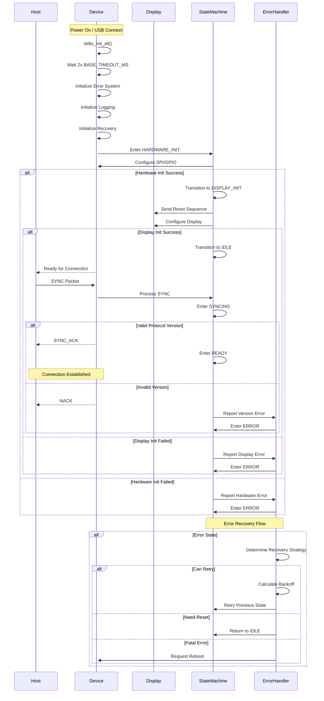
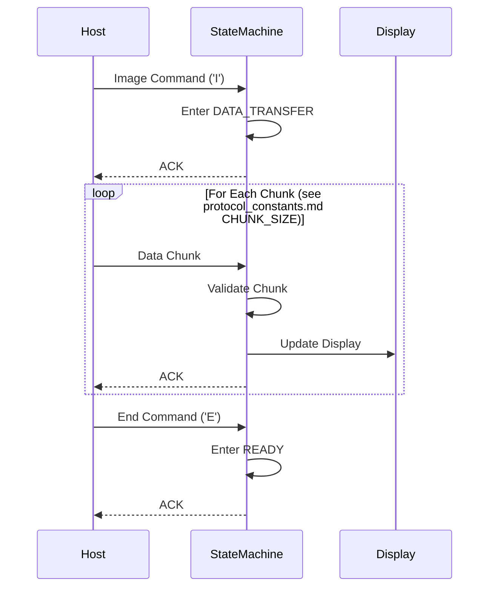
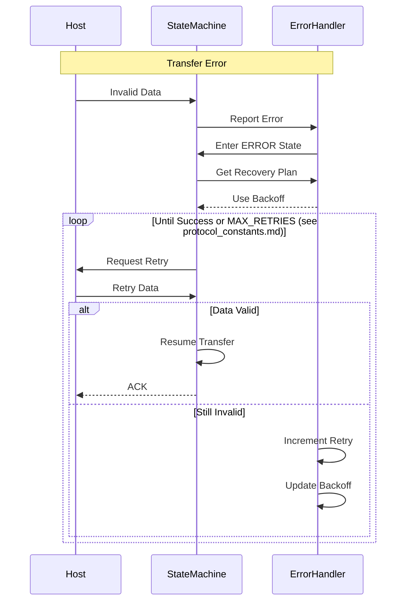

# Protocol State Transitions

> Note: All protocol constants referenced in this document (timeouts, retry counts, chunk sizes, etc.) are defined in the [Protocol Constants Reference](protocol_constants.md). Always refer to that document for the authoritative values.

## Core Operation Sequences

### 1. Connection Establishment



#### Boot and Connection Sequence

1. **Initial Boot**
   - Device powers on via USB connection
   - Initializes stdio with 2x BASE_TIMEOUT_MS delay for USB CDC
   - Sets up core systems (error handling, logging, recovery)

2. **Hardware Initialization**
   - Enters HARDWARE_INIT state
   - Configures SPI interface and GPIO pins
   - Validates hardware configuration
   - Transitions to DISPLAY_INIT on success

3. **Display Setup**
   - Sends reset sequence to display
   - Configures display parameters
   - Validates display response
   - Transitions to IDLE on success

4. **Connection Protocol**
   - Host initiates with SYNC packet
   - Device validates protocol version
   - Responds with SYNC_ACK if valid
   - Transitions to READY state
   - Connection established

5. **Error Recovery**
   - Errors can occur at any stage
   - Recovery strategy based on error type
   - Supports retry with backoff
   - Can reset to IDLE if needed
   - Fatal errors trigger reboot

### 2. Image Transfer



### 3. Error Recovery



## State Transition Rules

### 1. Valid State Transitions

```c
typedef struct {
    SystemState from_state;
    SystemState to_state;
    StateCondition condition;
    bool (*validator)(void);
} StateTransition;

static const StateTransition VALID_TRANSITIONS[] = {
    // Hardware Initialization
    {
        .from_state = STATE_HARDWARE_INIT,
        .to_state = STATE_DISPLAY_INIT,
        .condition = CONDITION_HARDWARE_READY,
        .validator = validate_hardware_init
    },
    {
        .from_state = STATE_HARDWARE_INIT,
        .to_state = STATE_ERROR,
        .condition = CONDITION_HARDWARE_FAILED,
        .validator = validate_hardware_error
    },
    
    // Display Initialization
    {
        .from_state = STATE_DISPLAY_INIT,
        .to_state = STATE_IDLE,
        .condition = CONDITION_DISPLAY_READY,
        .validator = validate_display_init
    },
    {
        .from_state = STATE_DISPLAY_INIT,
        .to_state = STATE_ERROR,
        .condition = CONDITION_DISPLAY_FAILED,
        .validator = validate_display_error
    },
    
    // Protocol States
    {
        .from_state = STATE_IDLE,
        .to_state = STATE_SYNCING,
        .condition = CONDITION_SYNC_RECEIVED,
        .validator = validate_sync_request
    },
    
    // ... additional transitions ...
};
```

### 2. Transition Validation

```c
bool validate_transition(SystemState current, SystemState next, StateCondition condition) {
    // Find matching transition
    const StateTransition *transition = find_transition(current, next, condition);
    if (!transition) {
        return false;
    }
    
    // Execute validator if present
    if (transition->validator && !transition->validator()) {
        return false;
    }
    
    return true;
}
```

### 3. State Actions

```c
typedef struct {
    void (*on_entry)(void);
    void (*on_exit)(void);
    void (*on_error)(ErrorContext *ctx);
} StateActions;

static const StateActions STATE_ACTIONS[] = {
    [STATE_HARDWARE_INIT] = {
        .on_entry = hardware_init_entry,
        .on_exit = hardware_init_exit,
        .on_error = hardware_init_error
    },
    [STATE_DISPLAY_INIT] = {
        .on_entry = display_init_entry,
        .on_exit = display_init_exit,
        .on_error = display_init_error
    },
    // ... actions for other states ...
};
```

## Implementation Examples

### 1. State Machine Core

```c
bool state_machine_transition(SystemState next_state, StateCondition condition) {
    SystemState current = state_machine_get_current();
    
    // Validate transition
    if (!validate_transition(current, next_state, condition)) {
        error_handler_report(ERROR_INVALID_TRANSITION);
        return false;
    }
    
    // Execute exit actions
    if (STATE_ACTIONS[current].on_exit) {
        STATE_ACTIONS[current].on_exit();
    }
    
    // Update state
    state_context.previous = current;
    state_context.current = next_state;
    state_context.transition_time = get_system_time();
    
    // Execute entry actions
    if (STATE_ACTIONS[next_state].on_entry) {
        STATE_ACTIONS[next_state].on_entry();
    }
    
    // Log transition
    log_state_transition(current, next_state, condition);
    
    return true;
}
```

### 2. Error Recovery

```c
bool error_handler_attempt_recovery(ErrorContext *ctx) {
    // Get recovery strategy
    RecoveryStrategy strategy = get_recovery_strategy(ctx);
    
    // Calculate retry delay (see protocol_constants.md for timing values)
    uint32_t delay = calculate_backoff_delay(ctx->retry_count);
    
    // Log recovery attempt
    log_recovery_attempt(ctx, strategy, delay);
    
    // Execute recovery actions
    switch (strategy) {
        case RECOVERY_NONE:
            return false;
            
        case RECOVERY_RETRY:
            sleep_ms(delay);
            return execute_retry_recovery(ctx);
            
        case RECOVERY_RESET_STATE:
            return execute_reset_recovery(ctx);
            
        case RECOVERY_REINIT:
            return execute_reinit_recovery(ctx);
            
        case RECOVERY_REBOOT:
            if (!config.allow_reboot) {
                return false;
            }
            system_reboot();
            return true;  // Never reached
    }
}
```

### 3. Transfer Management

```c
bool transfer_manager_process_chunk(const uint8_t *data, size_t len) {
    // Validate state
    if (state_machine_get_current() != STATE_DATA_TRANSFER) {
        error_handler_report(ERROR_INVALID_STATE);
        return false;
    }
    
    // Validate chunk size (see protocol_constants.md CHUNK_SIZE)
    if (!validate_chunk(data, len)) {
        error_handler_report(ERROR_INVALID_CHUNK);
        return false;
    }
    
    // Process chunk
    if (!process_chunk_data(data, len)) {
        error_handler_report(ERROR_CHUNK_PROCESSING);
        return false;
    }
    
    // Update progress
    transfer_context.received += len;
    
    // Check if transfer complete
    if (transfer_context.received >= transfer_context.total_size) {
        state_machine_transition(STATE_READY, CONDITION_TRANSFER_COMPLETE);
    }
    
    return true;
}
```

## Implementation Notes

### 1. State Consistency
- Always validate transitions before executing
- Maintain state history
- Log all transitions
- Track timing information

### 2. Error Handling
- Each state defines error handlers
- Support multiple recovery strategies
- Implement exponential backoff (see protocol_constants.md for timing values)
- Log recovery attempts

### 3. Resource Management
- Clean up resources on state exit
- Initialize resources on state entry
- Validate resource state
- Handle allocation failures

### 4. Testing
- Test all valid transitions
- Verify invalid transitions are rejected
- Test error recovery paths
- Validate state history

### 5. Performance Considerations
- Minimize time in critical sections
- Optimize state transitions
- Reduce memory allocations
- Cache frequently used data

### 6. Debug Support
- Log all state changes with debug module
- Track transition timing and duration
- Monitor resource usage and buffer states
- Record error contexts and recovery attempts
- Collect performance metrics
- Enable/disable debug features at runtime
- Reset debug statistics as needed
- Track state transition statistics:
  - Most frequent states
  - Failed transitions
  - Average time in each state
  - Recovery success rates
- Buffer usage statistics:
  - Peak usage
  - Overflow counts
  - Average utilization
- Performance metrics:
  - Operation timing
  - Retry frequencies
  - Error distribution
  - Recovery durations

### 7. State Machine Integration
- Debug module hooks in state transitions
- Performance monitoring of state actions
- Resource tracking in entry/exit handlers
- Validation failure logging
- Error context enrichment
- Recovery attempt tracking
- Buffer overflow detection
- Timing violation monitoring

## Test Pattern Commands

The device supports several built-in test patterns that can be triggered via single-byte commands over the serial interface. These patterns are useful for display testing, calibration, and diagnostics.

### Available Commands

| Command | ASCII | Description |
|---------|-------|-------------|
| `CMD_PATTERN_CHECKER` | '1' | Displays a black and white checkerboard pattern (20px squares) |
| `CMD_PATTERN_STRIPE` | '2' | Displays vertical color bars showing 8 basic colors |
| `CMD_PATTERN_GRADIENT` | '3' | Displays a smooth RGB gradient pattern |
| `CMD_HELP` | 'H' | Shows available commands and their descriptions |

### Host Interface

To send a test pattern command from the host:

1. Ensure the device is in the `STATE_COMMAND_PROCESSING` state
2. Send a single byte containing the command character
3. The device will respond with a status message indicating success or failure

Example using a serial terminal:
```bash
# Show checkerboard pattern
echo -n "1" > /dev/ttyACM0

# Show color bars
echo -n "2" > /dev/ttyACM0

# Show gradient pattern
echo -n "3" > /dev/ttyACM0

# Show help
echo -n "H" > /dev/ttyACM0
```

### Pattern Details

1. **Checkerboard Pattern**
   - Alternating black and white squares
   - Square size: 20x20 pixels
   - Tests contrast and edge sharpness
   - Useful for checking display alignment

2. **Color Bars Pattern**
   - 8 vertical bars showing basic colors:
   - Red, Green, Blue, Yellow, Magenta, Cyan, White, Black
   - Tests color reproduction and gamma
   - Useful for color calibration

3. **Gradient Pattern**
   - Smooth RGB gradient
   - Red varies with X position
   - Green varies with Y position
   - Blue varies diagonally
   - Tests color interpolation and banding

### Error Handling

If a pattern command fails, the device will:
1. Set success status to false
2. Return an error message
3. Maintain the current display state

Common error conditions:
- Display not initialized
- Invalid command state
- Insufficient resources
- Hardware communication failure
