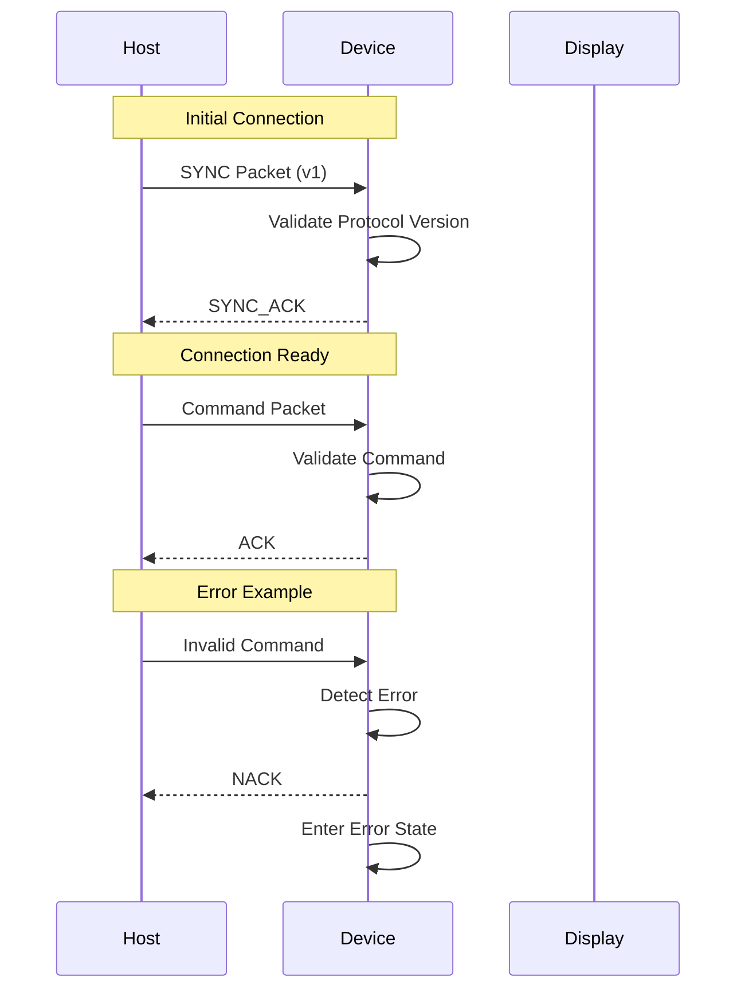
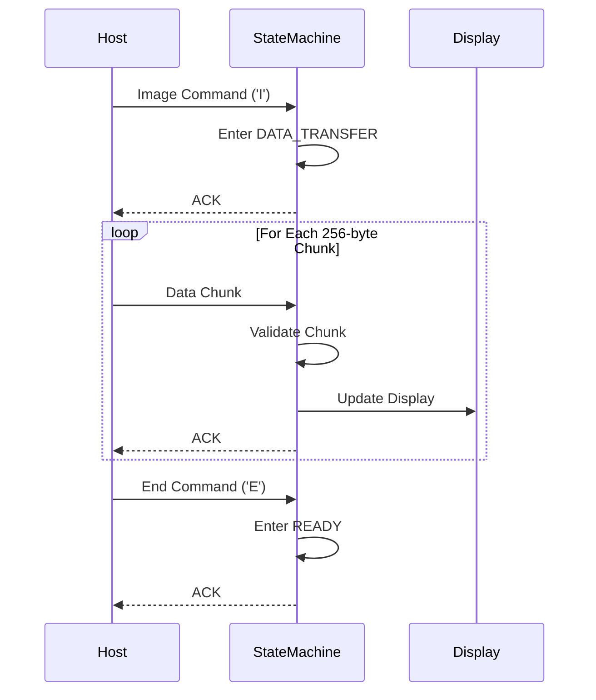
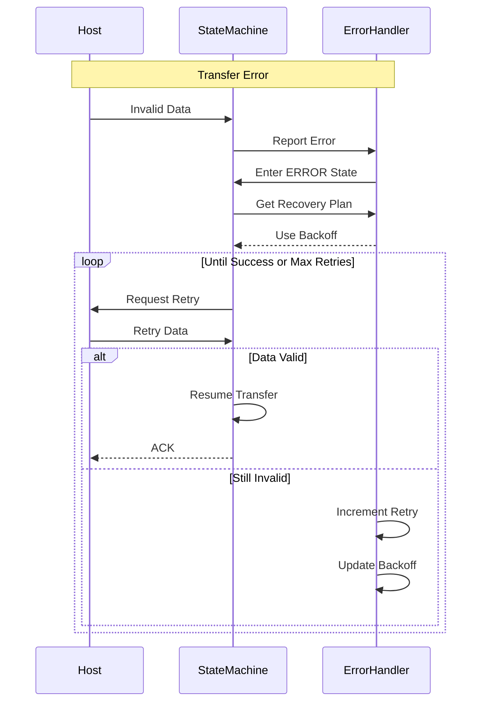

# Protocol State Transitions

## Core Operation Sequences

### 1. Connection Establishment



### 2. Image Transfer



### 3. Error Recovery



## State Transition Rules

### 1. Valid State Transitions

```c
typedef struct {
    SystemState from_state;
    SystemState to_state;
    StateCondition condition;
    bool (*validator)(void);
} StateTransition;

static const StateTransition VALID_TRANSITIONS[] = {
    // Hardware Initialization
    {
        .from_state = STATE_HARDWARE_INIT,
        .to_state = STATE_DISPLAY_INIT,
        .condition = CONDITION_HARDWARE_READY,
        .validator = validate_hardware_init
    },
    {
        .from_state = STATE_HARDWARE_INIT,
        .to_state = STATE_ERROR,
        .condition = CONDITION_HARDWARE_FAILED,
        .validator = validate_hardware_error
    },
    
    // Display Initialization
    {
        .from_state = STATE_DISPLAY_INIT,
        .to_state = STATE_IDLE,
        .condition = CONDITION_DISPLAY_READY,
        .validator = validate_display_init
    },
    {
        .from_state = STATE_DISPLAY_INIT,
        .to_state = STATE_ERROR,
        .condition = CONDITION_DISPLAY_FAILED,
        .validator = validate_display_error
    },
    
    // Protocol States
    {
        .from_state = STATE_IDLE,
        .to_state = STATE_SYNCING,
        .condition = CONDITION_SYNC_RECEIVED,
        .validator = validate_sync_request
    },
    
    // ... additional transitions ...
};
```

### 2. Transition Validation

```c
bool validate_transition(SystemState current, SystemState next, StateCondition condition) {
    // Find matching transition
    const StateTransition *transition = find_transition(current, next, condition);
    if (!transition) {
        return false;
    }
    
    // Execute validator if present
    if (transition->validator && !transition->validator()) {
        return false;
    }
    
    return true;
}
```

### 3. State Actions

```c
typedef struct {
    void (*on_entry)(void);
    void (*on_exit)(void);
    void (*on_error)(ErrorContext *ctx);
} StateActions;

static const StateActions STATE_ACTIONS[] = {
    [STATE_HARDWARE_INIT] = {
        .on_entry = hardware_init_entry,
        .on_exit = hardware_init_exit,
        .on_error = hardware_init_error
    },
    [STATE_DISPLAY_INIT] = {
        .on_entry = display_init_entry,
        .on_exit = display_init_exit,
        .on_error = display_init_error
    },
    // ... actions for other states ...
};
```

## Implementation Examples

### 1. State Machine Core

```c
bool state_machine_transition(SystemState next_state, StateCondition condition) {
    SystemState current = state_machine_get_current();
    
    // Validate transition
    if (!validate_transition(current, next_state, condition)) {
        error_handler_report(ERROR_INVALID_TRANSITION);
        return false;
    }
    
    // Execute exit actions
    if (STATE_ACTIONS[current].on_exit) {
        STATE_ACTIONS[current].on_exit();
    }
    
    // Update state
    state_context.previous = current;
    state_context.current = next_state;
    state_context.transition_time = get_system_time();
    
    // Execute entry actions
    if (STATE_ACTIONS[next_state].on_entry) {
        STATE_ACTIONS[next_state].on_entry();
    }
    
    // Log transition
    log_state_transition(current, next_state, condition);
    
    return true;
}
```

### 2. Error Recovery

```c
bool error_handler_attempt_recovery(ErrorContext *ctx) {
    // Get recovery strategy
    RecoveryStrategy strategy = get_recovery_strategy(ctx);
    
    // Calculate retry delay
    uint32_t delay = calculate_backoff_delay(ctx->retry_count);
    
    // Log recovery attempt
    log_recovery_attempt(ctx, strategy, delay);
    
    // Execute recovery actions
    switch (strategy) {
        case RECOVERY_RESET:
            return execute_reset_recovery(ctx);
            
        case RECOVERY_RETRY:
            sleep_ms(delay);
            return execute_retry_recovery(ctx);
            
        case RECOVERY_FALLBACK:
            return execute_fallback_recovery(ctx);
            
        default:
            return false;
    }
}
```

### 3. Transfer Management

```c
bool transfer_manager_process_chunk(const uint8_t *data, size_t len) {
    // Validate state
    if (state_machine_get_current() != STATE_DATA_TRANSFER) {
        error_handler_report(ERROR_INVALID_STATE);
        return false;
    }
    
    // Validate chunk
    if (!validate_chunk(data, len)) {
        error_handler_report(ERROR_INVALID_CHUNK);
        return false;
    }
    
    // Process chunk
    if (!process_chunk_data(data, len)) {
        error_handler_report(ERROR_CHUNK_PROCESSING);
        return false;
    }
    
    // Update progress
    transfer_context.received += len;
    
    // Check if transfer complete
    if (transfer_context.received >= transfer_context.total_size) {
        state_machine_transition(STATE_READY, CONDITION_TRANSFER_COMPLETE);
    }
    
    return true;
}
```

## Implementation Notes

### 1. State Consistency
- Always validate transitions before executing
- Maintain state history
- Log all transitions
- Track timing information

### 2. Error Handling
- Each state defines error handlers
- Support multiple recovery strategies
- Implement exponential backoff
- Log recovery attempts

### 3. Resource Management
- Clean up resources on state exit
- Initialize resources on state entry
- Validate resource state
- Handle allocation failures

### 4. Testing
- Test all valid transitions
- Verify invalid transitions are rejected
- Test error recovery paths
- Validate state history

### 5. Performance Considerations
- Minimize time in critical sections
- Optimize state transitions
- Reduce memory allocations
- Cache frequently used data

### 6. Debug Support
- Log all state changes
- Track transition timing
- Monitor resource usage
- Record error contexts
