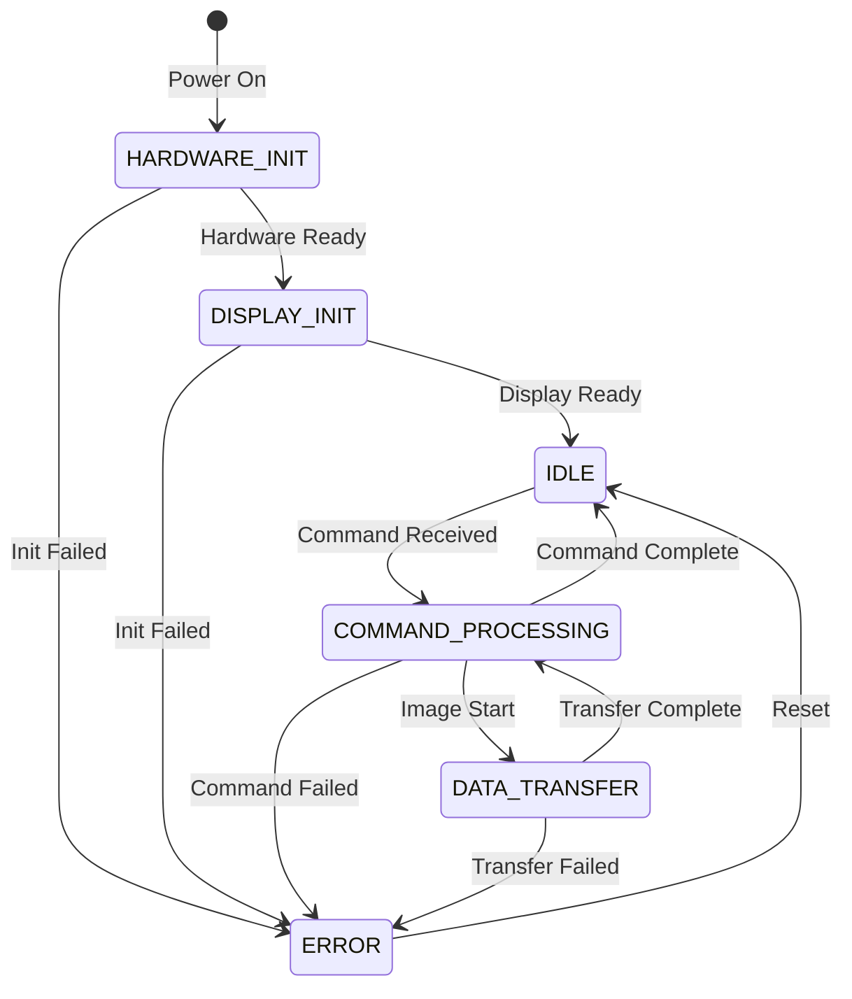

# State Machine Documentation

## Overview

The DeskThang state machine manages the lifecycle of the device, from hardware initialization through command processing and error handling. It provides a robust framework for managing device state and ensuring safe transitions between operations.

## State Diagram



## States

### HARDWARE_INIT
- Initial state after power-on
- Configures SPI, GPIO, and system clocks
- Validates hardware subsystems
- Transitions to DISPLAY_INIT on success

### DISPLAY_INIT
- Initializes GC9A01 display
- Configures display parameters
- Runs display self-test
- Transitions to IDLE when ready

### IDLE
- Default operational state
- Awaits commands from host
- Monitors system health
- Transitions to COMMAND_PROCESSING on command

### COMMAND_PROCESSING
- Processes commands received in protocol packets
- Validates packet headers and command payloads
- Performs protocol validation:
  - Sequence numbers
  - Checksums
  - Command parameters
- Executes display operations
- Manages command context
- Can transition to DATA_TRANSFER or back to IDLE

### DATA_TRANSFER
- Handles image data reception
- Manages transfer buffers
- Validates data integrity
- Returns to COMMAND_PROCESSING when complete

### ERROR
- Handles error conditions
- Implements recovery procedures
- Logs error information
- Can reset to IDLE after recovery

## State Transitions

### Valid Transitions
1. HARDWARE_INIT → DISPLAY_INIT
   - Triggered by: Hardware initialization complete
   - Requirements: All hardware subsystems ready
   - Actions: Begin display initialization sequence

2. DISPLAY_INIT → IDLE
   - Triggered by: Display initialization complete
   - Requirements: Display configured and responsive
   - Actions: Run initial display test patterns

3. IDLE → COMMAND_PROCESSING
   - Triggered by: Valid packet received
   - Requirements: 
     - Valid packet header
     - Valid command in payload
     - Protocol validation passed
   - Actions: 
     - Initialize command context
     - Begin command processing

4. COMMAND_PROCESSING → DATA_TRANSFER
   - Triggered by: Image transfer command
   - Requirements: Buffer space available
   - Actions: Prepare transfer buffers

5. DATA_TRANSFER → COMMAND_PROCESSING
   - Triggered by: Transfer complete
   - Requirements: All data received
   - Actions: Process received data

### Error Transitions
- Any State → ERROR
  - Triggered by: Critical failures
  - Actions: Log error, attempt recovery
  
- ERROR → IDLE
  - Triggered by: Recovery complete
  - Actions: Reset state, reinitialize if needed

## State Management

### State Context
```c
typedef struct {
    SystemState current_state;
    SystemState previous_state;
    uint32_t state_entry_time;
    uint32_t last_transition_time;
    ErrorInfo last_error;
} StateContext;
```

### State Validation
- Pre-transition validation
- Post-transition verification
- Timeout monitoring
- Resource validation

### Error Recovery
1. Automatic Recovery
   - State reset procedures
   - Hardware reinitialization
   - Buffer cleanup

2. Manual Recovery
   - Host-initiated reset
   - Error acknowledgment
   - Full system reset

## Integration with Command System

### Command to State Mapping
- All commands are received in protocol packets
- Commands trigger state transitions based on type:
  - Display commands (test patterns, help)
  - Data transfer commands (image transfer)
- Each command follows the protocol:
  - Full packet validation
  - Sequence tracking
  - Error detection and recovery
- State machine validates all commands
- State determines valid commands
- Error states block command processing

### Resource Management
- State-specific resource allocation
- Buffer management per state
- Hardware access control
- Error condition handling
