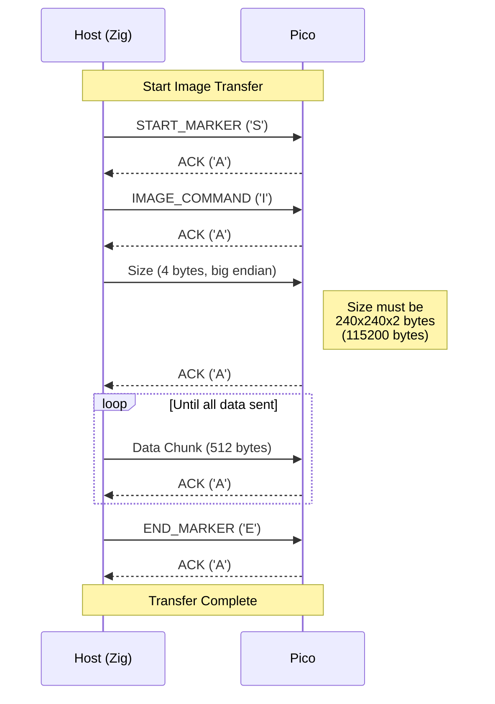

# DeskThang

A Raspberry Pi Pico based desktop display device. Uses the GC9A01 240x240 round LCD display.

## Hardware

- Raspberry Pi Pico (RP2040)
- GC9A01 240x240 Round LCD Display
- Connections:
  - MOSI: GPIO 19
  - SCK: GPIO 18
  - CS: GPIO 17
  - DC: GPIO 16
  - RST: GPIO 20

## Building

### Pico Firmware
```bash
mkdir build && cd build
cmake ..
make
```
Flash the resulting `display_test.uf2` file to your Pico.

### Host Application 
```bash
zig build
```

## Usage

Run the host application:
```bash
sudo zig build run
```

Available commands:
1. Checkerboard - Black and white checkerboard pattern
2. Stripes - Red and blue stripes
3. Gradient - Red gradient
4. Image - Send PNG image to display
5. Exit

For image display, the PNG must be:
- 240x240 pixels
- RGB format (will be converted to RGB565)

## Image Transfer Protocol

The host and device communicate over USB serial (115200 baud) using a simple protocol:



### Protocol Details:

1. Host sends START_MARKER ('S')
   - Indicates start of image transfer
   - Pico responds with ACK ('A')

2. Host sends IMAGE_COMMAND ('I')
   - Puts Pico in image receive mode
   - Pico responds with ACK ('A')

3. Host sends image size (4 bytes)
   - Big endian format
   - Must be 115200 bytes (240x240x2)
   - Pico responds with ACK ('A')

4. Host sends image data in chunks
   - Each chunk is 512 bytes
   - Last chunk may be smaller
   - Pico responds with ACK after each chunk

5. Host sends END_MARKER ('E')
   - Indicates end of transfer
   - Pico responds with final ACK ('A')

### Error Handling

- Timeouts: Each read operation has a 1-second timeout
- Size validation: Pico verifies image size matches display requirements
- Retries: Host will retry up to 3 times when waiting for ACK
- Logging: Both sides log operation progress for debugging
