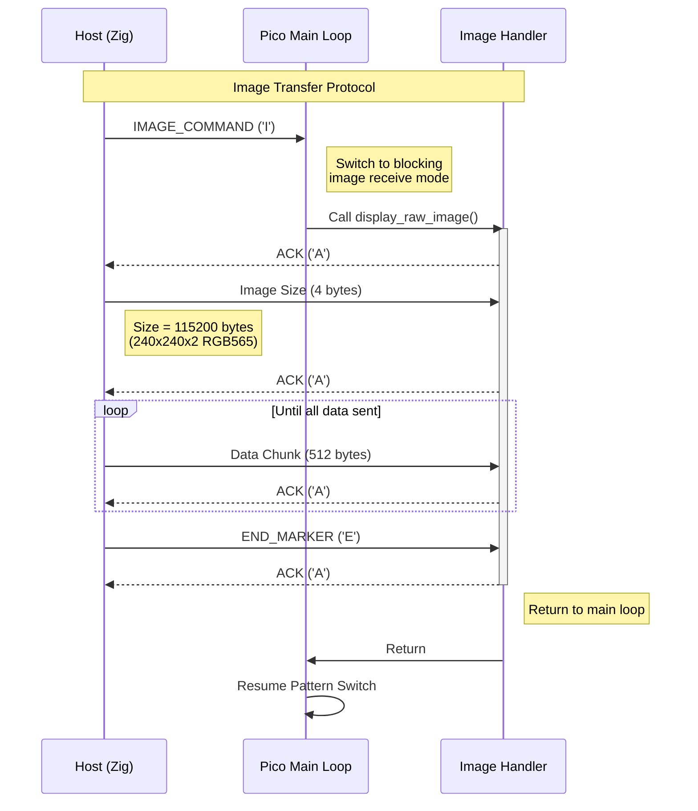

# DeskThang Display Project

A desk display project using Raspberry Pi Pico (RP2040) with a GC9A01 LCD screen. The project consists of a Pico firmware and a Zig host application that can push images and patterns to the display over USB.

## Setup

1. Clone the repository with submodules:
```bash
git clone [repository-url]
git submodule update --init --recursive
```

2. Build the Pico firmware:
```bash
cd pico
mkdir build
cd build
cmake ..
make
```

3. Build the Zig host application:
```bash
cd host
zig build
```

## Communication Protocol

The host and Pico communicate over USB serial (ttyACM0) using a simple protocol:



### Protocol Details:
- Image data is sent in RGB565 format (2 bytes per pixel)
- Display resolution is 240x240 pixels
- Data is sent in 512-byte chunks
- Each command/chunk requires acknowledgment ('A')
- Timeout of 5000ms for each operation
- Up to 3 retries per operation

### Commands:
- 'I': Start image transfer
- 'E': End image transfer
- '1': Show checkerboard pattern
- '2': Show stripe pattern
- '3': Show gradient pattern

## Hardware Setup
- Screen: GC9A01 240x240 Round LCD
- Microcontroller: Raspberry Pi Pico (RP2040)
- Connections:
  - MOSI: GPIO 19
  - SCK: GPIO 18
  - CS: GPIO 17
  - DC: GPIO 16
  - RST: GPIO 20

## Dependencies
- Pico SDK (submodule)
- Zig 0.11.0 or later
- CMake 3.13 or later
- libpng for the host application
